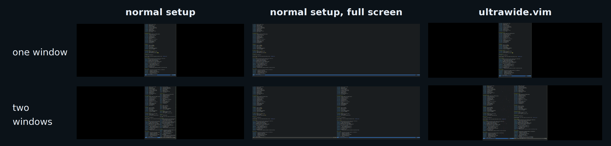

# ultrawide.vim

`ultrawide.vim` solves the issue with ultrawide setups where running Vim in fullscreen gives you neck pain. This plugins allows you to run Vim in non-fullscreen and maintain GUI window size and position. It targets only full-height vertical splits where adjusting GUI window geometry makes sense.

- when creating a new vertical split, it increases GUI window width and shifts the window accordingly to the left
- when closing a vertical split, it decreases GUI window width and shifts the window accordingly to the right

Live demo:

https://github.com/noscript/ultrawide.vim/assets/717109/6da7302d-1c9b-4e60-9e77-3649e36fc9e7

## Requirements:

* `WinNewPre` event, see https://github.com/vim/vim/pull/12761
* `xwininfo` (X11), PRs to support other platforms are welcome!
